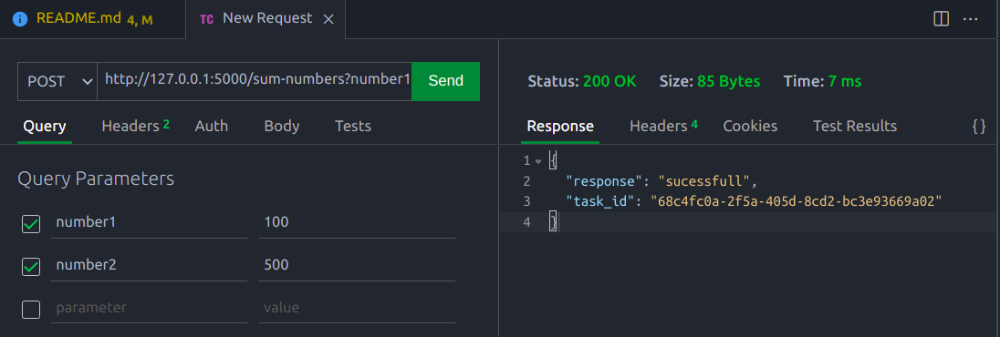

# 🎯 Simple Integration between Celery and Flask using Docker

## 📖 About

This project consists of a simple integration between celery and flask using docker. It shows the creation of an asynchronous task.

## 🛠 Technologies used

For the development of this simple project, the following technologies were used:

- celery
- flask
- docker
- redis

## ⚙ How to run the project

To reproduce this project follow the steps below:

- Clone this repository:

  ```sh
  git clone git@github.com:lucasousa/flask-celery.git
  ```

- Enter the flask-celery folder:

  ```sh
  cd flask-celery
  ```

- Create the docker image:

  ``` sh
   docker-compose build
  ```

- Start the containers:

  ``` sh
   docker-compose up -d
  ```

- Call the endpoint "http://127.0.0.1:5000/sum-numbers" passing two numbers in the query params, as in the example below.

  

 - Finally the task is created and a txt file with the sum of the two numbers passed is created in the project root. The endpoint returns the id of the created task.
## ⚖ License

This repository is under license from [MIT](./LICENSE).
